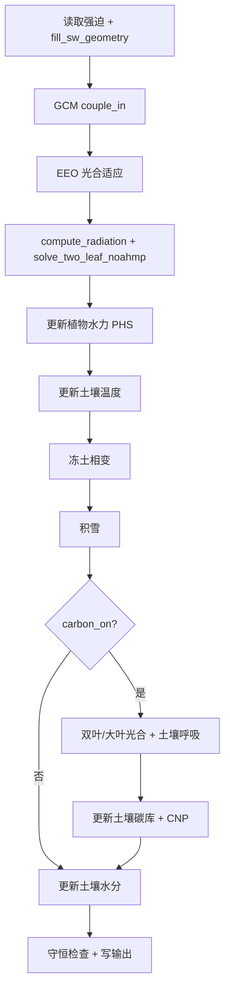

# 单点陆面模式（LSM）技术手册

本文档介绍 `/home/chai/class/data/LSM` 目录下单点陆面模式的**运行方法**、**代码结构**与**物理过程**。模式为纯 Fortran 实现（F2008，`real64`），面向站点尺度陆气相互作用与植被–土壤–碳氮磷耦合的快速原型研究。

---

## 1. 模式概览

| 项目 | 说明 |
|------|------|
| 空间尺度 | 单点（0-D），无水平异质性 |
| 时间步长 | 默认 1800 s（30 min），由 `namelist.nml` 配置 |
| 强迫数据 | 文本或 NetCDF，逐时步大气边界条件 |
| 辐射方案 | Noah-MP 两流短波 + Noah 长波层间交换（`irad=1`） |
| 能量平衡 | Noah-MP 序贯冠层/地面求解，双叶独立 `Tc`（`icanopy=2`） |
| 物理框架 | Noah-MP 风格多物理开关（`istomatal`、`icanopy`、`irad` 等） |
| 碳循环 | 可选（`carbon_on`），含双叶 GPP、土壤呼吸、简化 CNP |
| 编译依赖 | `gfortran`（F2008）+ NetCDF Fortran（`netcdf-fortran`） |

默认配置：Medlyn 气孔 + 双叶冠层 + 两流辐射 + PHS 植物水力 + Richards 土壤水 + 微生物土壤碳 + CNP + EEO 光合适应。

---

## 2. 目录结构

```
LSM/
├── src/                    # Fortran 源码
│   ├── main.f90            # 主程序入口
│   ├── gen_forcing.f90     # 合成强迫生成器（10 列 txt）
│   ├── gen_soil_init.f90   # 土壤初值生成器
│   ├── mod_kinds.f90       # 精度定义 (dp = real64)
│   ├── mod_constants.f90   # 物理常数
│   ├── mod_physics.f90     # 物理方案开关常量
│   ├── mod_types.f90       # 核心派生类型
│   ├── mod_radiation.f90   # 湿度、比湿、离线净辐射、SW 几何推断
│   ├── mod_radtran.f90     # Noah 两流短波 + Noah 长波交换
│   ├── mod_turbulence.f90  # Monin-Obukhov 湍流
│   ├── mod_conductance.f90 # 气孔导度 (Jarvis / Medlyn)
│   ├── mod_canopy.f90      # 双叶气孔与冠层光合
│   ├── mod_acclimation.f90 # EEO 光合适应
│   ├── mod_planthydro.f90  # 植物水力 (PHS)
│   ├── mod_soil_heat.f90   # 土壤温度 / 地面热通量
│   ├── mod_soil_water.f90  # 土壤水分 (Bucket / Richards)
│   ├── mod_snow.f90        # 积雪（MVP）
│   ├── mod_permafrost.f90  # 冻土相变（MVP）
│   ├── mod_photosyn.f90    # Farquhar C3 光合
│   ├── mod_soil_carbon.f90 # 土壤碳 (Q10 / 微生物)
│   ├── mod_cnp.f90         # 简化 CASA-CNP
│   ├── mod_surface.f90     # Noah-MP 序贯能量平衡
│   ├── mod_gcm_coupling.f90# GCM 边界占位耦合
│   ├── mod_forcing.f90     # 强迫文件读写（txt / nc）
│   ├── mod_ncio.f90        # NetCDF I/O
│   ├── mod_soil_init.f90   # 土壤初值加载
│   ├── mod_conservation.f90# 能量/水分守恒检查
│   ├── mod_io.f90          # Namelist 与输出
│   └── mod_driver.f90      # 时间积分驱动
├── scripts/
│   ├── txt_to_nc_forcing.py
│   ├── txt_to_nc_soil_init.py
│   └── generate_technical_manual.py
├── namelist.nml
├── Makefile
├── LSM_TECHNICAL_MANUAL.docx
├── data/
│   ├── txt/sample_forcing.txt
│   ├── txt/sample_soil_init.txt
│   ├── nc/sample_forcing.nc
│   └── nc/sample_soil_init.nc
├── results/
│   ├── txt/output.txt
│   └── nc/output.nc
└── bin/
    ├── lsm
    ├── gen_forcing
    └── gen_soil_init
```

---

## 3. 编译与运行

### 3.1 环境要求

- Linux / macOS，已安装 `gfortran`
- NetCDF Fortran 库（`nf-config` 可用）
- `make` 构建工具
- Python 3 + `xarray`（仅用于 txt→nc 转换脚本）

### 3.2 编译

```bash
cd /home/chai/class/data/LSM
make
```

生成 `bin/lsm`、`bin/gen_forcing`、`bin/gen_soil_init`。

### 3.3 一键运行（默认 NetCDF 配置）

```bash
make run
```

等价于：编译 → 生成 txt 强迫/土壤初值 → 转 nc → 运行 `./bin/lsm`。

### 3.4 分步运行

1. 编辑 `namelist.nml`（`config_nml` + `param_nml`）
2. 准备强迫：`make forcing-nc` 或自备 nc/txt 文件
3. 准备土壤初值：`make soil-init-nc`
4. 在 `LSM/` 根目录执行 `./bin/lsm`

### 3.5 Spin-up

驱动将强迫序列循环 `nspinup + 1` 次：前 `nspinup` 次仅演化状态不写输出，最后一次写入 `output_file`。索引通过 `get_forcing` 取模循环。

---

## 4. 模式架构

### 4.1 程序调用链

```
main.f90
  └─ read_namelist()          [mod_io]
  └─ run_lsm()                [mod_driver]
       ├─ load_forcing()      [mod_forcing → mod_ncio]
       ├─ load_soil_init()
       ├─ init_state()
       ├─ init_output()
       └─ 时间循环 (spin-up × N + production)
            ├─ couple_in()              [mod_gcm_coupling]
            ├─ update_acclimation()
            ├─ solve_energy_balance()   ← Noah-MP 序贯 Tc/Ts
            ├─ update_plant_hydro()
            ├─ update_soil_temperature()
            ├─ update_phase_change()    [冻土]
            ├─ update_snow()
            ├─ [carbon_on] canopy_photosynthesis / photosynthesis
            ├─ [carbon_on] soil_respiration, update_soil_carbon, update_cnp
            ├─ update_soil_water()
            ├─ couple_out()
            ├─ check_balances()
            └─ write_output()  (仅 production)
```

### 4.2 核心数据类型（`mod_types.f90`）

| 类型 | 用途 | 主要字段 |
|------|------|----------|
| `t_forcing` | 大气强迫 | `SW`, `LW`, `Ta`, `P`, `WS`, `PA`, `CO2`, `RH`, `cos_sza`, `sw_beam_frac`, `VPD`（派生） |
| `t_state` | 模式状态 | `Ts`, `Tc`, `LAI`, `LAI_sun/shade`, `beta`, `W`, `psi_*`, `Tsoil(:)`, `theta(:)`, 碳氮磷库, `snow_*` |
| `t_param` | 站点参数 | 粗糙度、植被、土壤、水力、碳分解、`clumping` 等 |
| `t_config` | 运行配置 | 文件路径、时间步、`icanopy`, `irad`, `isnow`, `ifrost` 等物理开关 |
| `t_flux` | 通量诊断 | `Rn`, `H`, `LE`, `G`, `SW_abs_canopy/ground`, `PAR_sun/shade`, `GPP_sun/shade`, `albedo_eff` 等 |

### 4.3 单时间步计算顺序



**耦合要点：**

- `mod_radtran::compute_radiation` 在能量平衡前计算 Noah 短波吸收与长波系数，输出 `SW_abs_canopy/ground`、`PAR_sun/shade`。
- `solve_two_leaf_noahmp` 序贯迭代冠层 `Tc`（20×MO）与地面 `Ts`（5×），外层 Picard ×3；Medlyn 嵌套于冠层迭代。
- 通量组装：`H = H_canopy + H_ground`，`LE = LE_canopy + LE_soil`。
- 植物水力在能量平衡之后用 `flux%ET` 更新水势链。

---

## 5. 输入输出格式

### 5.1 强迫文件

**文本格式**（首行注释，每行一时步）：

```
# SW LW Ta P WS PA CO2 RH cos_sza sw_beam_frac
```

| 列 | 变量 | 单位 | 说明 |
|----|------|------|------|
| SW | 短波辐射 | W/m² | 向下总量 |
| LW | 长波辐射 | W/m² | 向下 |
| Ta | 气温 | K | |
| P | 降水 | mm | 该时间步内累积 |
| WS | 风速 | m/s | 参考高度 2 m |
| PA | 气压 | Pa | |
| CO2 | CO₂ 浓度 | ppm | |
| RH | 相对湿度 | % | 读入后派生 VPD |
| cos_sza | cos(太阳天顶角) | 1 | 可选；缺省从 SW 推断 |
| sw_beam_frac | 直射束比例 | 0–1 | 可选；缺省从 SW 推断 |

8 列旧格式向后兼容。缺测值 `-9999`（`mod_constants::miss`）。

**NetCDF 格式**（`data/nc/sample_forcing.nc`）：

- 维度：`time`
- 必选变量：`SW`, `LW`, `Ta`, `P`, `WS`, `PA`, `CO2`, `RH`
- 可选变量：`cos_sza`, `sw_beam_frac`
- 转换：`python3 scripts/txt_to_nc_forcing.py data/txt/sample_forcing.txt -o data/nc/sample_forcing.nc`

### 5.2 输出文件

**NetCDF**（默认 `results/nc/output.nc`，23 变量）：

`step`, `SW`, `LW`, `Ta`, `P`, `WS`, `Rn`, `H`, `LE`, `G`, `Ts`, `beta`, `W`, `GPP`, `NEE`, `Rleaf`, `Rsoil`, `psi_leaf`, `stress_hydro`, `snow_swe`, `GPP_sun`, `GPP_shade`, `albedo_eff`

**文本**（`results/txt/output.txt`）仍可通过 namelist 切换路径使用。

### 5.3 Namelist 配置

#### `&config_nml` — 运行控制

| 变量 | 默认 | 说明 |
|------|------|------|
| `forcing_file` | `data/nc/sample_forcing.nc` | 强迫路径（txt 或 nc） |
| `soil_init_file` | `data/nc/sample_soil_init.nc` | 土壤温湿度初值 |
| `output_file` | `results/nc/output.nc` | 输出路径 |
| `dt` | 1800.0 | 时间步长 (s) |
| `nspinup` | 2 | spin-up 循环次数 |
| `carbon_on` | `.true.` | 碳循环开关 |
| `max_iter` | 50 | 大叶模式能量平衡最大迭代 |
| `tol` | 5.0 | 能量平衡收敛阈值 (W/m²) |
| `istomatal` | 2 | 1=Jarvis，2=Medlyn |
| `icanopy` | 2 | 1=大叶，2=双叶 |
| `irad` | 1 | 0=离线，1=两流，2=GCM 耦合 |
| `ihydro` | 2 | 1=beta，2=PHS |
| `isoilwater` | 2 | 1=Bucket，2=Richards |
| `isnow` | 1 | 积雪开关 |
| `ifrost` | 1 | 冻土相变开关 |
| `isoilcarbon` | 2 | 1=Q10，2=微生物 |
| `icnp` | 3 | 0=关，1=C，2=CN，3=CNP |
| `eeo_on` | `.true.` | EEO 光合适应 |

#### `&param_nml` — 站点参数

主要分组：地表/植被（`z0`, `albedo`, `lai`, `clumping`）、气孔（`g0`, `g1`）、光合（`vcmax`, `jmax`）、土壤水力/热性质、植物水力（`p50_xylem`, `psi50_leaf`）、土壤碳与养分。

---

## 6. 物理过程（摘要）

### 6.1 辐射（`mod_radtran` + `mod_radiation`）

- **短波**（`irad=1`）：Noah-MP Dickinson/Niu-Yang 两流，vis（48%）+ nir 两波段；直射/散射由 `cos_sza`、`sw_beam_frac` 控制。
- **长波**：Noah-MP 冠层–地面层间交换系数（`noah_lw_coeff_*`），层净辐射 `noah_rn_layer`。
- **PAR**：`partition_par` 划分阴阳叶吸收，驱动双叶光合。
- **离线**（`irad=0`）：固定反照率单层净辐射，用于对照。

### 6.2 地表能量平衡（`mod_surface`）

- **双叶**（`icanopy=2`）：`solve_two_leaf_noahmp` — 序贯求 `Tc`、`Ts`，嵌套 MO 稳定度与 Medlyn 气孔。
- **大叶**：单面 Newton 求 `Ts`。
- 残差 `flux%ebal_res` 为层内瞬时平衡残差；未收敛时打印警告。

### 6.3 气孔、光合、水力、土壤

与 v2.0 文档一致：Medlyn/Jarvis、Farquhar C3、PHS、Richards van Genuchten、微生物碳、CNP。双叶模式下光合使用 `PAR_sun`/`PAR_shade` 与 `LAI_sun`/`LAI_shade`。

### 6.4 积雪与冻土（MVP）

- `mod_snow`：降水相态划分、积雪 SWE/反照率/表面温度。
- `mod_permafrost`：土壤冰–水相变与液态含水率调整。

---

## 7. 物理方案组合示例

### 7.1 最小能量–水分（无碳、离线辐射）

```fortran
carbon_on = .false.
icanopy   = 1
irad      = 0
istomatal = 1
ihydro    = 1
isoilwater = 1
```

### 7.2 当前默认（Noah-MP 风格）

```fortran
carbon_on = .true.
icanopy   = 2
irad      = 1
istomatal = 2
ihydro    = 2
isoilwater = 2
```

### 7.3 对照实验建议

固定强迫，对比 `irad=0` vs `irad=1`、`icanopy=1` vs `icanopy=2`，检查 `albedo_eff`、`Rn`、`H`、`LE`、`GPP_sun/shade` 日变化。

---

## 8. 已知限制

1. **单点 0-D**：无完整多层冠层（`icanopy=3` 未实现）；GCM 耦合为占位。
2. **MVP 参数化**：积雪、冻土、PHS、Richards、CNP 需青藏高原站点标定。
3. **能量平衡残差**：部分时步仍可达 40–250 W/m²。
4. **叶光学参数**：`rho_leaf`、`tau_leaf` 硬编码于 `mod_radtran`。
5. **碳 spin-up**：仅循环短期强迫，未实现多年气候序列。

---

## 9. 扩展开发指引

| 目标 | 建议修改模块 |
|------|-------------|
| 新强迫变量 | `mod_types::t_forcing`, `mod_forcing`, `mod_ncio`, `gen_forcing` |
| 新辐射方案 | `mod_radtran.f90`, `mod_physics.f90` |
| 新能量求解器 | `mod_surface.f90` |
| 叶光学 namelist | `mod_types::t_param`, `mod_radtran` |
| f2py / Python 接口 | 封装 `run_lsm`，另建 binding 层 |

---

## 附录：Makefile 目标

| 命令 | 作用 |
|------|------|
| `make` / `make all` | 编译全部可执行文件 |
| `make forcing` | 生成 `data/txt/sample_forcing.txt` |
| `make forcing-nc` | txt → `data/nc/sample_forcing.nc` |
| `make soil-init-nc` | 生成土壤初值 nc |
| `make run` | 编译 + 数据准备 + 运行 |
| `make clean` | 删除 `build/` 与 `bin/` |

---

*文档版本 2.1，与 `/home/chai/class/data/LSM/src` 源码同步（2026-06）。详细公式见 `LSM_TECHNICAL_MANUAL.docx`。*